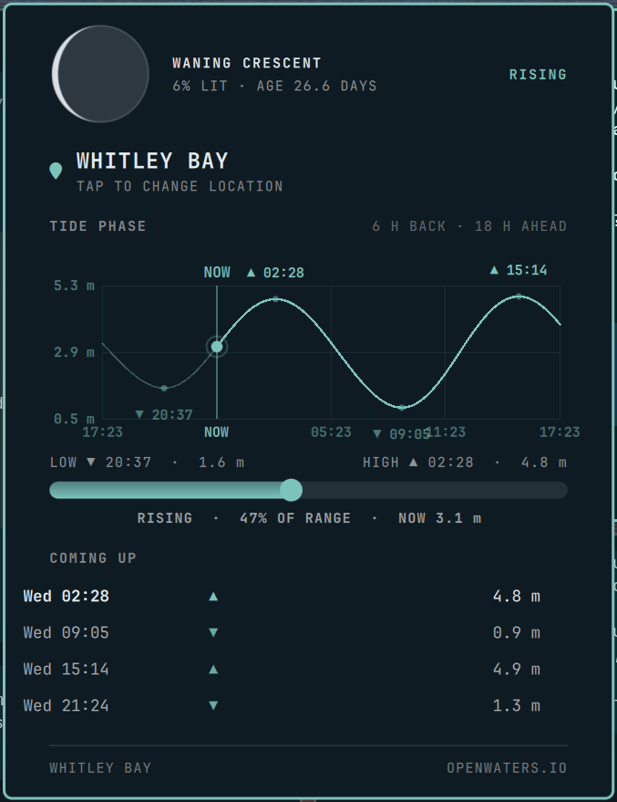

# Omarchy Tide

A searchable tide bar widget for [Omarchy](https://omarchy.org/).

Adds a tide pill to the bar showing the next high/low (▲/▼) with a tide-curve
popup: a live location search picks any coastal place, and its high/low
extremes drive a rolling 6 h back / 18 h ahead wave, a LOW→HIGH water gauge,
and the upcoming events. The header replaces the removed location line with a
simple drawn lunar disc — the current phase with the lit side facing the sun,
waxing to the right, waning to the left — plus the phase, % lit and age
alongside. Data comes from the Open Waters tide API
(api.openwaters.io), which resolves the picked place to the nearest published
tide reference station, and is cached per location so the panel works offline.

## Preview

The expanded panel on the bar (Whitley Bay, UK):



## Install

Requires an Omarchy system (Hyprland + the Omarchy shell).

```sh
omarchy plugin add https://github.com/Gnosis80s/OmarchyTide.git --enable
```

The command clones the repo, validates it against the Omarchy plugin schema,
installs it to `~/.config/omarchy/plugins/whitleybay.tide/`, and places it in
the center of the bar. The bar hot-reloads; no shell restart is needed.

Not on the bar after all? Enable it manually:

```sh
omarchy plugin enable whitleybay.tide --section center
```

## Usage

- **Left click** on the pill: open/close the tide panel.
- **Middle click**: refresh the tide data.
- In the panel, tap the location to search; pick a suggestion to load that
  place. The chosen location persists across restarts.

## Notes

- The first time you open the panel you'll be asked to pick a location —
  search for your nearest coastal town.
- Coordinates and station are resolved per location; an inland pick resolves
  to the closest tide station, so results describe the nearest coast.
- Requires `curl`, `bash`, and GNU `date` (all standard on Arch), plus network
  access to `api.openwaters.io` and `geocoding-api.open-meteo.com` (the live
  location lookup) at least once for fresh data.
- Data is cached to `~/.local/state/omarchy/settings/whitleybay-tide-<location>-*.json`
  and the location to `whitleybay-tide-location.json` for offline use.
- The bar pill and panel accent colors follow your active Omarchy theme.

## Layout

```
whitleybay.tide/
├── manifest.json     # Plugin manifest (id, entry point, bar-widget metadata)
├── BarWidget.qml     # Bar pill: mini water gauge + next event time
├── Panel.qml         # Popup: location search, tide wave chart, gauge, upcoming events
└── Model.js          # Tide API parsing, geocoding, and interpolation helpers
```